## 笔记一

* 为什么要学习C语言：乔布斯，比尔盖茨从小喜欢编程  改变与创造 UNIX  C语言 

* 第一个C语言程序：HELLO,WORLD!

* 每个人都应该学会如何编程，因为它教我们怎么思考

* 如何学好C语言？ 精讲，多练 

* 计算机科学导论  C程序设计语言 

* 适不适合学习C语言：只要会键盘和鼠标就行

## 计算机文化基础

* ENIAC第一台计算机  计算机之父：冯·诺依曼

冯诺依曼模型：
1. 计算机是二进制（只有0和1，用完要进位：0，1，进位→10，11，进位→100，101，110，111，进位→1000，1001，1010，1011，1100，1101，1110，1111进位→
八进制 十六进制 计算机只能读懂二进制
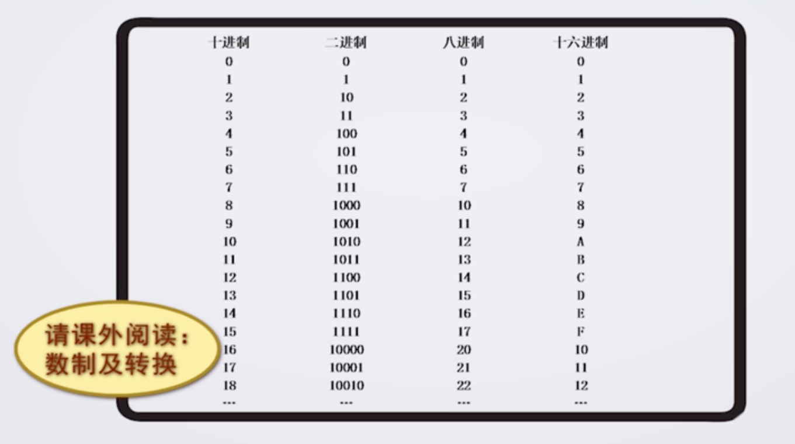
2. 由五大部件组成：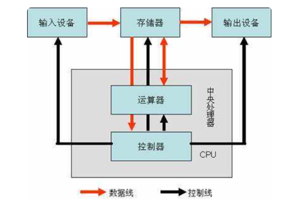
3. 计算机是按照存储程序的原理工作的：预先编好程序（一系列指令的有序集合），利用输入设备把程序输入内存，计算机在控制器控制下，从内存中逐条取出程序交运算器执行。把结果回送入内存、或由输出设备输出。
4. 计算机语言（机器语言）→汇编语言（人能看懂，低级语言）→高级语言
* C语言-面向过程的高级语言
由于计算机只能读懂计算机语言，人只学习高级语言，这需要翻译：解释（同声翻译） 编译（C语言所用，翻译完再解释）
* Tiobe编程语言社区

## 第一节课：让计算机开口说话
1. 任何一个C语言的程序有且仅有一个 main 主函数（function 是为了完成一个功能）

2. 任何一个语句以分号`;`结尾

3. 对于`int main` ，C 语言认为一个函数就应该有一个值、有一个结果，会产生随机数（我们无法掌控）而我们只是为了让 main 函数完成一个主功能，不需要垃圾数
    我们加入` int (integer)`代表整数，结尾有`return 0`，告诉计算机 main 是有数的（整数 0 ），不要产生随机数了。
    取 0 因为 C 语言 main 函数规范中，程序运行正确返回 0，否则为非 0

4.	头文件
用`\n`换行

5. 注意 :

   * 小写字母

   * 英文输入法

   *  `main()`

   * 先搭好框架

     * ```C
       #include<stdio.h>
       int main()
       {
           return 0;
       }
       ```

## 第二节课：让计算机帮忙做算术

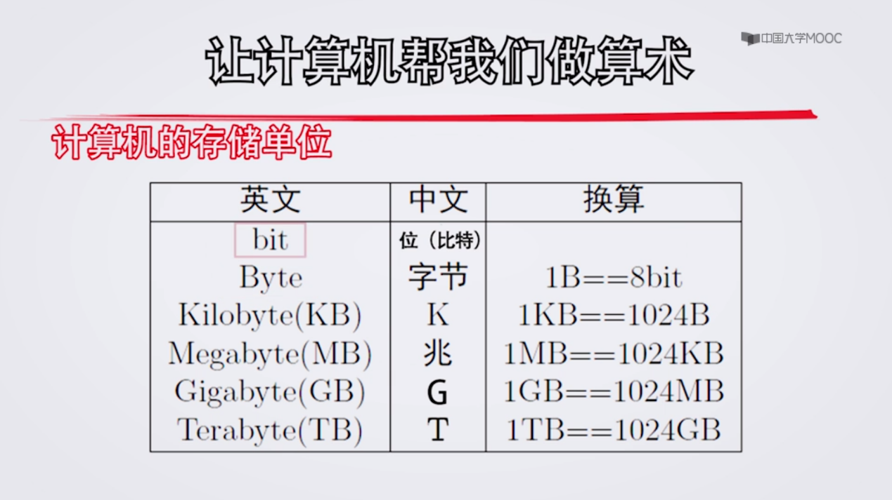

2^10=1024

把计算机存储看为抽屉，一个抽屉里有八个数字（由0，1组成），构成一个字节（Byte）

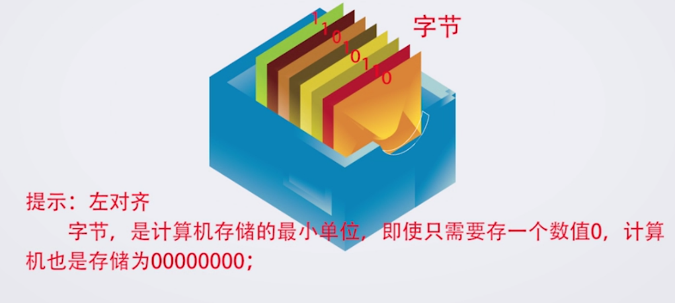

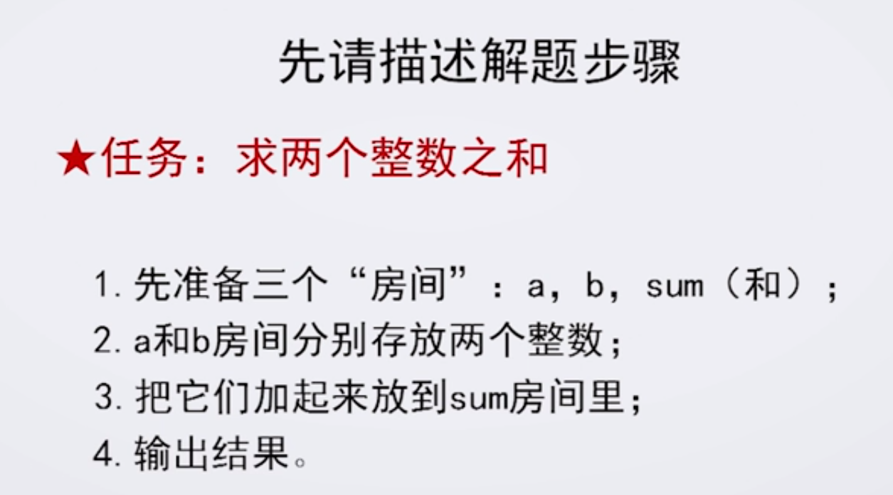

变量 ：赋值`= `，给房间取名时赋予一定的意义

**变量一定要先声明再使用**

输入输出函数库：`printf`：把双引号里的内容原封不动的输出在屏幕上

`scanf`：原封不动的把双引号的内容从键盘上给我（输入）

`&`：取地址

* 设计时考虑用户的体验
* 提升程序的可读性
  * 让花括号单独一行，相互呼应。

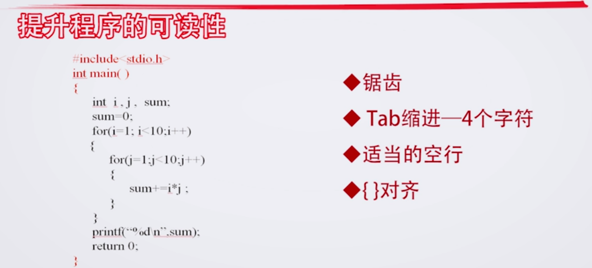

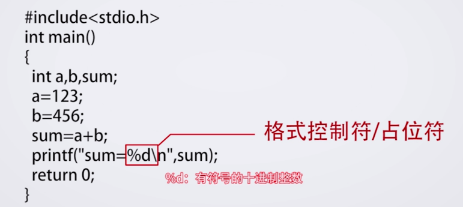

## 第三节课：让计算机自己做决定

表示自己的算法：流程图

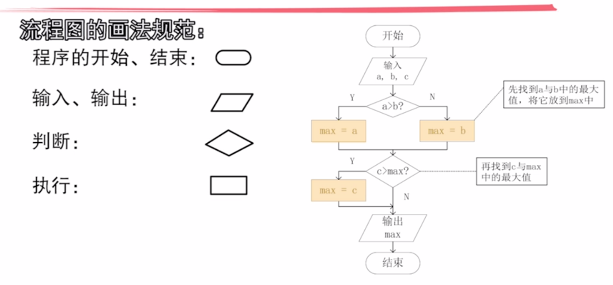

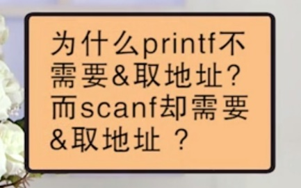

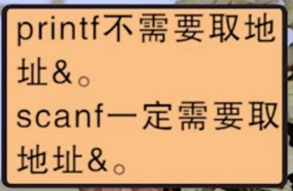

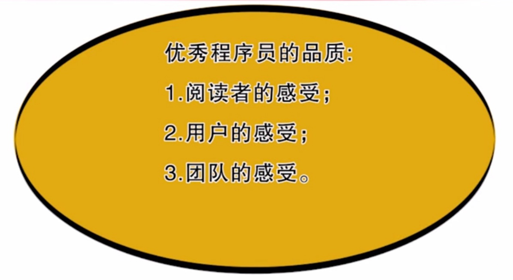

Tips:

1. main 函数有且仅有一个 且函数后有`()`语法规定 `main()`

2. English

3. printf函数内容换行一定要注意 不能直接用回车

   * 可用 \n 

   * 可换行用新的printf

   * 用两次双引号